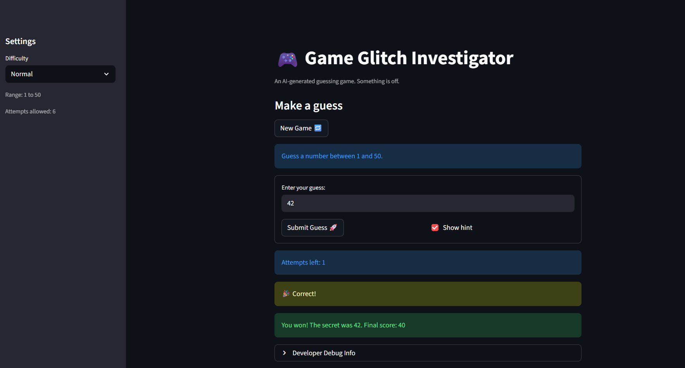
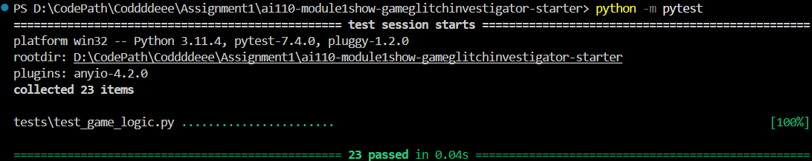

# 🎮 Game Glitch Investigator: The Impossible Guesser

## 🚨 The Situation

You asked an AI to build a simple "Number Guessing Game" using Streamlit.
It wrote the code, ran away, and now the game is unplayable. 

- You can't win.
- The hints lie to you.
- The secret number seems to have commitment issues.

## 🛠️ Setup

1. Install dependencies: `pip install -r requirements.txt`
2. Run the broken app: `python -m streamlit run app.py`

## 🕵️‍♂️ Your Mission

1. **Play the game.** Open the "Developer Debug Info" tab in the app to see the secret number. Try to win.
2. **Find the State Bug.** Why does the secret number change every time you click "Submit"? Ask ChatGPT: *"How do I keep a variable from resetting in Streamlit when I click a button?"*
3. **Fix the Logic.** The hints ("Higher/Lower") are wrong. Fix them.
4. **Refactor & Test.** - Move the logic into `logic_utils.py`.
   - Run `pytest` in your terminal.
   - Keep fixing until all tests pass!

## 📝 Document Your Experience

### Game's Purpose
The Number Guessing Game is a Streamlit-based interactive game where the player tries to guess a randomly selected secret number within a given range. The game includes three difficulty levels (Easy: 1-20, Normal: 1-50, Hard: 1-100), with corresponding attempt limits. Players receive hints ("Go HIGHER" or "Go LOWER") after each guess and earn points based on how quickly they solve it. The goal is to win by guessing the secret number before running out of attempts.

### Bugs Found

1. **Attempts display off by one** - "Attempts left" showed 7 instead of 8 because the counter started at 1 instead of 0
2. **Enter key not submitting** - Pressing Enter in the text input didn't submit the guess; only the button click worked
3. **Reversed hints** - Hints were backwards ("Go HIGHER" when player guessed too high, vice versa) due to logic error and a bizarre str/int conversion bug
4. **New Game button incomplete** - Only reset attempts and secret, didn't reset score, history, or status
5. **Hardcoded difficulty range** - UI always said "Guess between 1 and 100" regardless of difficulty selection
6. **Backwards difficulty mapping** - Hard was 1-50 (easier) and Normal was 1-100 (harder), opposite of what they should be
7. **"Out of attempts" timing bug** - Loss condition triggered at wrong attempt count

### Fixes Applied

1. **Initialize attempts to 0** - Changed session state initialization from 1 to 0 so display starts at correct attempt limit
2. **Implement Streamlit form** - Wrapped input in `st.form()` with `st.form_submit_button()` to support Enter key submission
3. **Fix reversed hints** - Corrected `check_guess()` function logic and removed the intentional str/int conversion that was breaking hints
4. **Complete New Game reset** - Now resets all state: attempts, score, history, status, and generates new secret respecting difficulty
5. **Dynamic range display** - Changed hardcoded "1 and 100" to use `{low}` and `{high}` variables from difficulty function
6. **Swap difficulty ranges** - Easy: 1-20 (8 attempts), Normal: 1-50 (6 attempts), Hard: 1-100 (5 attempts)
7. **Refactor logic to logic_utils.py** - Moved all game logic functions (get_range_for_difficulty, parse_guess, check_guess, update_score) into separate module and created comprehensive pytest test suite with 26 test cases covering edge cases

## 📸 Demo

- 

## 🚀 Stretch Features

- 
